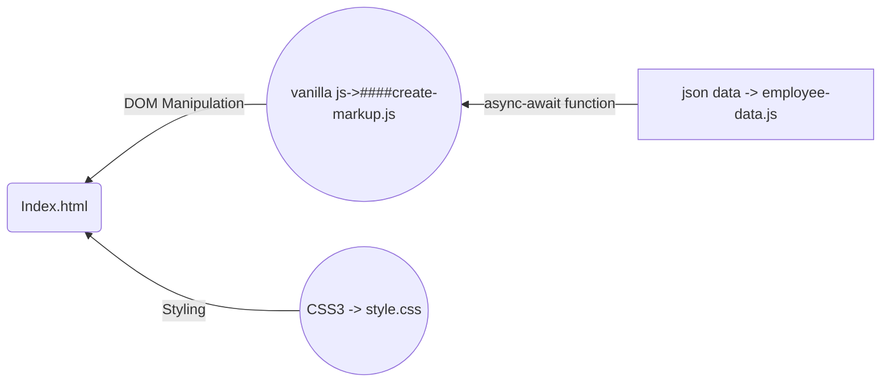

# Welcome to Employee-rendring !

**Employee-rendring** is the small web application which fetch the json data and render it on html page with the help of **vanilla javascript**

## Introducation

This project is made to learn about DOM maipulation with the help of vanilla javascript and make use of async-await function to fetch the json data

## **Technologies**

The languages we used.

- HTML5
- CSS3
- VANILLA JAVASCRIPT

HTML5 is used to create the markup of the websites. CSS3 is use to style the website and also make it responsive. Vanilla javascript is used to fetch the json data from online repository

## Flow chart

[LIVE DEMO](<[https://sumilraweng.github.io/employee-list/](https://sumilraweng.github.io/employee-list/)>)
